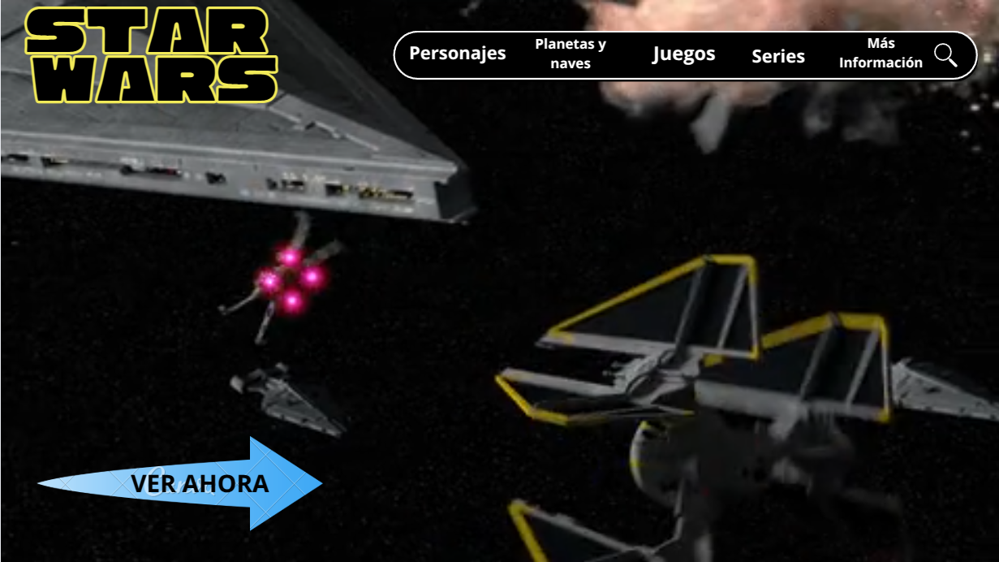

# 🌌 Star Wars Web Page

Una página web interactiva inspirada en el universo de **Star Wars**, y buscador de StarWars para que el usuario pueda visualizar de manera correcta todos los datos de Starwars hasta el día de hoy. Explora personajes, naves, series y más.

---

## 🧾 Tabla de contenidos

- [🔭 Descripción](#-descripción)
- [🎬 Características](#-características)
- [⚙️ Tecnologías usadas](#️-tecnologías-usadas)
- [📸 Portada](#-portada)
- [📚 Maqetación](#-maquetación)
- [📩 Contacto](#-contacto)

---

## 🔭 Descripción

Este proyecto es una página web dedicada al universo de Star Wars. Puedes explorar personajes, ver series, y descubrir datos curiosos utilizando la API pública de Star Wars (SWAPI).

---

## 🎬 Características

- 🔎 Búsqueda de personajes, planetas y naves, series, juegos.
- 📄 Detalles individuales de cada apartado.
- 🪐 Datos en tiempo real desde la [SWAPI](https://swapi.py4e.com/).
- 📱 Diseño responsivo compatible con móviles.

---

## ⚙️ Tecnologías usadas

- **HTML5 / CSS / JavaScript**
- **Bootstrap** o **Tailwind CSS**
- **Fetch API**
- **SWAPI** - Star Wars API

---
## 📸 Portada

---
## 📚 Maquetación
-(https://www.canva.com/design/DAGovHHONu4/FRHC-QU4bWSYXsSkUzUpuA/edit?utm_content=DAGovHHONu4&utm_campaign=designshare&utm_medium=link2&utm_source=sharebutton)

---

## 😊 Autores

Proyecto realizado por Valentina Delgado y Camila Florez.

---

## 📩 Contacto GitHub
- https://github.com/ValentinaDelgadoRincon
- https://github.com/CamilaFlorez12
